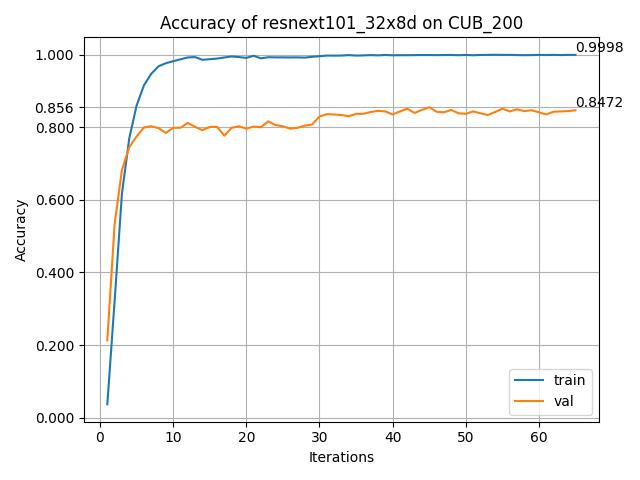

# ResNet-on-CUB-200
## SYSU 2023春 人工神经网络 wrs 部分内容

### 参数设置
```
INIT_TRAINER = {
    'net_name':'resnext101_32x8d',
    'lr':5e-5, 
    'n_epoch':200,
    'num_classes':200,
    'image_size':256,
    'batch_size':16,
    'train_mean':[0.48560741861744905, 0.49941626449353244, 0.43237713785804116],   
    'train_std':[0.2321024260764962, 0.22770540015765814, 0.2665100547329813],     
    'num_workers':2,        
    'device':DEVICE,
    'pre_trained':False,
    'weight_decay': 1e-3,          
    'momentum': 0.9,             
    'gamma': 0.1,                 
    'milestones': [30,60,90],         
    'T_max':5,                    
    'use_fp16':True,             
    'dropout':0.01              
 }
```

### 训练结果




